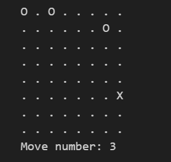

# Dutch_TicTacToe_in_Python

## universal credits:

Chat GPT-3.5 was gebruikt bij het helpen maken van alle versies.

  

### De eerste spelversie Credits:

In deze project versie gebruikte ik deze website als mijn starting punt: https://thepythoncode.com/article/make-a-tic-tac-toe-game-pygame-in-python

Ik heb uiteindelijk hun iconen gebruikt en ik heb hun script onderaan de website gebruikt als basis voor mijn spel.

  

Ik heb ook iconen van icons8 gebruikt, dus om hen te crediteren is hier hun link: icons8.com

Hiermee zijn de credits van de eerste versie afgelopen:

  

### The second game version Credits:

In deze projectversie heb ik een script van mijn klant als uitgangspunt gebruikt.

Hiermee zijn de credits van de tweede versie afgelopen:

  

## De goal:

De opdracht begon als de beschrijving van: een zero-sum bordspel met machine learning als tegenstander met een grafische gebruikersinterface.

De opdracht werd verschoven naar een Tic Tac Toe-spel in een raster van 6 bij 6 met Minimax als machine learning.

De doelgroep waren volwassenen met weinig tot geen technische achtergrond.

De output van het eindproduct was om te laten zien hoe machine learning/AI invloed kan hebben op hoe dingen spelen, zoals in dit geval de moeilijkheidsgraad van het spel.

  

## De software die ik heb gebruikt:

Ik gebruik Visual studio code als mijn GUI.
  - Ik voegde toe een environment die ik gemaakt heb op Anaconda via CTRL + SHIFT + P en dan selecteer "select interpreter"
  - Ik voegde toe "Pygame" via de "pip install pygame" command in de terminal dit was dan toegevoegd aan mijn Anaconda environment.
  - Ik voegde toe Python plug-in.
  - Ik voegde toe Jupyter notebook plug-in.

Ik gebruik Anaconda als mijn pakketbeheerder.
- Ik voegde toeJupyter Notebooks
- Ik voegde toe Qt console

  

### De details van de eerste spelversie:

Dit deel van het project was gericht op de belangrijkste spelmechanismen en het maken van het spel met fatsoenlijke graphics, zoals het gebruik van afbeeldingen als sprites.

Ik werkte op basis van iteraties en het duurde twee iteraties om deze versie te maken.

Dit zijn de gerelateerde bestanden van deze versie:
- tictactoe.py
- tictactoe.ipynb
- Ga naar de "images" folder
  - en download alle foto's.

 De code voor het .ipynb bestand voert alleen de code uit die in het tictactoe.py bestand staat.

  

### Details van de tweede spelversie:

In deze versie heb ik mijn focus verlegd van gebruikerservaring naar functionaliteit.

Alle functies die ik wilde laten werken, werken in deze versie, maar dit ging ten koste van de visuele kwaliteit en de gebruikersvriendelijkheid.

Ik heb gewerkt op basis van iteraties en deze versie heeft één iteratie gekost om te maken.

Dit zijn de gerelateerde bestanden van deze versie:
- in de map “andere versies van het spel”,
  - kun je de map “2.0less-graphical-AI-focused-game” vinden,
    - die dit Jupyter-notitieboekbestand “MiniMax_AI_implementation_game.ipynb” bevat.
Dit is het enige bestand dat u nodig hebt

  

## Hoe activeer/gebruik ik .ipynb bestanden:

Download het .ipynb-bestand en open het door te klikken op de pijl uitvoeren linksboven van het segment dat u wilt activeren/gebruiken.

  

##  hoe .py-bestanden te activeren/gebruiken:

Download deze bestanden van dit project.
- tictactoe.py
- de afbeeldingen in de map “images

Elke keer dat je Visual studio code opent, moet je het volgende invoeren om vast te stellen in welke map je werkt:

cd "insert directory of tictactoe.py location" 

Merk op dat de afbeeldingen in een map Afbeeldingen moeten staan in de map van de tictactoe.py locatie.

Nu de map correct is, moet u de volgende code invoeren telkens wanneer u uw code wilt uitvoeren:

python .\"InsertPyGameTitle.py"

      

# English_TicTacToe_in_Python

## universal credits:

Chat GPT-3.5 was used to support development in all versions.

  

### The first game version Credits:

In this project version i used this website as my starting point: https://thepythoncode.com/article/make-a-tic-tac-toe-game-pygame-in-python

I ended up using their icon assets and, i used their script at the bottom of the website as my baseline to base my game off.

  

I also used icons from icons8 so to credit them here's there link: icons8.com

this concludes the credits of the first version:

  

### The second game version Credits:

In this project version i used a script made by my client as starting point.

this concludes the credits of the second version:
  

## the goal:

The assigment started as the description of: a zero-sum boardgame using machine learning as opponent with a Graphical User Interface.

The assigenment whas shifted to be a Tic Tac Toe game in a 6 by 6 grid using Minimax as machine learning.

The target audience was adults with little to none techinical background.

The output of the end product was to show how machine learning/AI can effect how things play out as in this case it was the AI difficulty of the game
  

## the software i used:

I'm using Visual studio code as my GUI.
  - I added the environment i made on Anaconda through CTRL + SHIFT + P and then selected "select interpreter"
  - I added "Pygame" through this "pip install pygame" command in the terminal this was than applied to my Anaconda environment.
  - I added the Python plug-in.
  - I added the Jupyter notebook plug-in.

I'm using Anaconda as my package manager.
- I added Jupyter Notebooks
- I added Qt console

  

### The first game version details:

This part of the project was focussed on core game-play mechanics, and creating the game with decent graphics like using images as sprites.

I worked based on iterations and this version took two iterations to make.

These are the related files to this version:
- tictactoe.py
- tictactoe.ipynb
- Go to the "images" folder
  - and download all images.

  The code for the .ipynb file only executes the code that is in the tictactoe.py file.

  

### The second game version details:

In this version i shifted my focus from user experience to functionality.

all features i intended to get working work in this version how ever, this was at cost of the visual quality and User-friendliness

I worked based on iterations and this version took one iterations to make.

These are the related files to this version:
- in the "other-versions-of-the-game" folder,
  - you can find the "2.0less-graphical-AI-focused-game" folder,
    - which holds this "MiniMax_AI_implementation_game.ipynb" Jupyter notebook file.
^this is the only file you need

  

## How to activate/use .ipynb files:

Download and open the .ipynb file proceed by click on the execute arrow at the left top from the segment you want to activate/use.

  

## how to actiovate/use .py files:

Download these files from this project.
- tictactoe.py
- the images in the "images" folder

You will need to enter the following every time you open Visual studio code to establish the folder you're working in:

cd "insert directory of tictactoe.py location" 

do note that the images should be in a Images folder inside the directory of the tictactoe.py location

Now that the directory is correct you wil need to enter the following code every time you want to execute you're code:

python .\"InsertPyGameTitle.py"