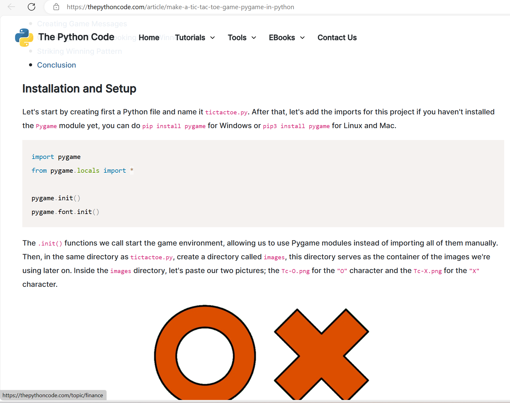
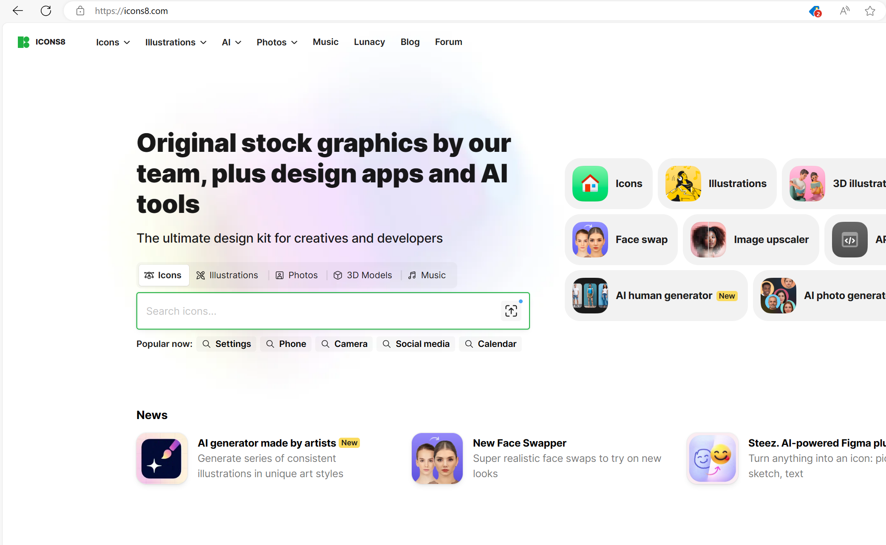

# TicTacToe_in_Python

## universal credits:

Chat GPT-3.5 was used to support development in all versions.

  

### The first game version Credits:

In this project version i used this website as my starting point: https://thepythoncode.com/article/make-a-tic-tac-toe-game-pygame-in-python

  

I ended up using their icon assets and, i used their script at the bottom of the website as my baseline to base my game off.

I also used icons from icons8 so to credit them here's there link: icons8.com

this concludes the credits of the first version:

  

### The second game version Credits:

In this project version i used a script made by my client as starting point.

this concludes the credits of the second version:
  

## the goal:

I'm actively adapting the code to my own project and i plan on integrating machine learning to play the O side of the game.

  

## the software i used:

I'm using Visual studio code as my GUI.
  - I added the environment i made on Anaconda through CTRL + SHIFT + P and then selected "select interpreter"
  - I added "Pygame" through this "pip install pygame" command in the terminal this was than applied to my Anaconda environment.
  - I added the Python plug-in.
  - I added the Jupyter notebook plug-in.

I'm using Anaconda as my package manager.
- I added Jupyter Notebooks
- I added Qt console

  

### The first game version details:

This part of the project was focussed on core game-play mechanics, and creating the game with decent graphics like using images as sprites.

I worked based on iterations and this version took two iterations to make.

These are the related files to this version:
- tictactoe.py
- tictactoe.ipynb
- Go to the "images" folder
  - and download all images.

  The code for the .ipynb file only executes the code that is in the tictactoe.py file.

  

### The second game version details:

In this version i shifted my focus from user experience to functionality.

all features i intended to get working work in this version how ever, this was at cost of the visual quality and User-friendliness

I worked based on iterations and this version took one iterations to make.

These are the related files to this version:
- in the "other-versions-of-the-game" folder,
  - you can find the "2.0less-graphical-AI-focused-game" folder,
    - which holds this "MiniMax_AI_implementation_game.ipynb" Jupyter notebook file.
^this is the only file you need

  

## How to activate/use .ipynb files:

Download and open the .ipynb file proceed by click on the execute arrow at the left top from the segment you want to activate/use.

  

## how to actiovate/use .py files:

Download these files from this project.
- tictactoe.py
- the images in the "images" folder

You will need to enter the following every time you open Visual studio code to establish the folder you're working in:

cd "insert directory of tictactoe.py location" 

do note that the images should be in a Images folder inside the directory of the tictactoe.py location

Now that the directory is correct you wil need to enter the following code every time you want to execute you're code:

python .\"InsertPyGameTitle.py"